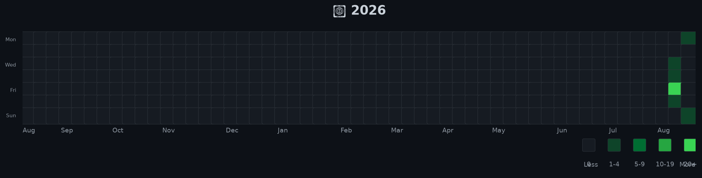
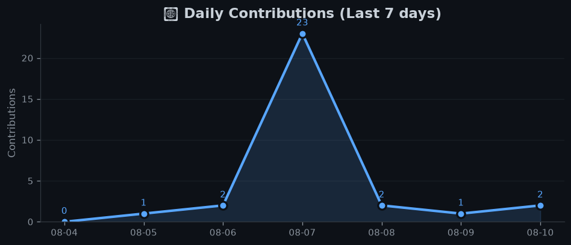

<div align="center">
  
# ✨ Yien1024 ✨

<!-- 打字效果动画 -->
<a href="https://git.io/typing-svg">
  
</a>

<!-- 社交徽章 -->
<p>
  <a href="https://github.com/Yien1024">
    
  </a>
  <a href="https://github.com/Yien1024/Yien1024">
    
  </a>
  <a href="https://github.com/Yien1024/Yien1024">
    
  </a>
  
  
</p>


</div>

## 👨‍💻 About Me

```yaml
name: Yien
location: 🌏
languages: [Python, JavaScript, HTML, CSS]
interests: [Coding, Open Source, AI]
```

---

## 🛠️ Tech Stack

<p align="center">
  
  
  
  
  
  
  
  
</p>

---

## 📊 GitHub Activity Report

> ⏱️ 自动更新于 `2026-08-10 06:11 UTC`

<div align="center">

### 🔥 Contribution Calendar




### 📈 Multi-Time Range Activity Overview

| Period | Commits | PRs | Issues | Reviews |
|--------|:-------:|:---:|:------:|:-------:|
| 📅 **Last 7 days** | **0** | **0** | **0** | **0** |
| 📅 **Last 14 days** | **0** | **0** | **0** | **0** |
| 📅 **Last 30 days** | **0** | **0** | **0** | **0** |
| 📅 **Last 90 days** | **0** | **0** | **0** | **0** |
| 📅 **Last 365 days** | **0** | **0** | **0** | **0** |

</div>

### 🏆 Top Active Repositories (Last 90 Days)

1. **[Yien1024/Yien1024](https://github.com/Yien1024/Yien1024)** — 0 次提交
2. **[Yien1024/AI_Live2D_DeepSeek](https://github.com/Yien1024/AI_Live2D_DeepSeek)** — 0 次提交

### 📈 7-Day Trend



### 🔥 Contribution Streak

<div align="center">

| Current Streak | Longest Streak |
|:--------------:|:--------------:|
| **6** days 🔥 | **6** days 🏆 |

</div>

---

## 🏆 GitHub Trophies

<div align="center">


</div>

---

## ⏰ Live Time Zone Clock

<div align="center">

| 🌍 UTC | 🇨🇳 Beijing (CST) | 🇯🇵 Tokyo (JST) | 🇺🇸 New York (EST) | 🇬🇧 London (BST) |
|:------:|:-----------------:|:---------------:|:------------------:|:----------------:|
| 06:11 | 14:11 | 15:11 | 01:11 | 07:11 |

</div>

---

## 📊 GitHub Stats

<div align="center">

| Stats | Languages | Streak |
|:-----:|:---------:|:------:|
|  |  |  |

</div>

---

## 🐍 Contribution Snake

<div align="center">


</div>

---

<div align="center">

### 💡 "Code is like humor. When you have to explain it, it's bad." — Cory House

*✨ This profile README is auto-generated by GitHub Actions ✨*

</div>