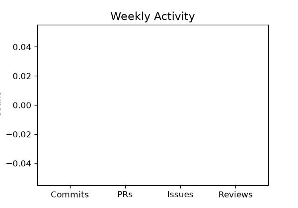
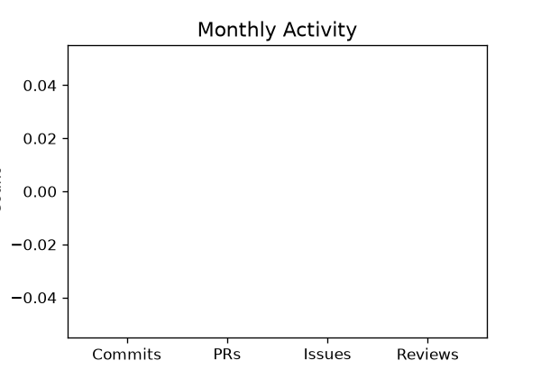
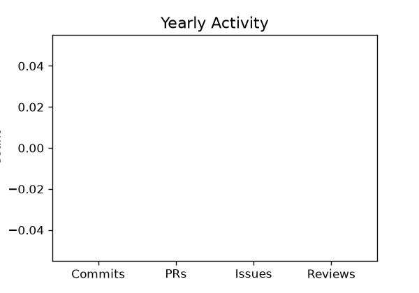
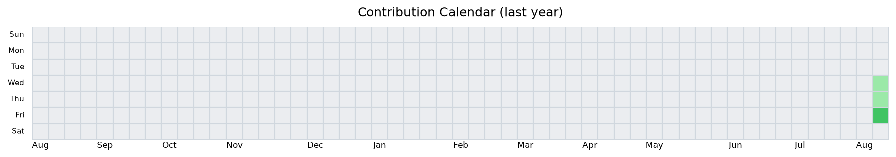

# Hi there 👋

## 📊 GitHub 活动报告
> 自动更新于 2026-08-07 03:46 UTC

### 🔥 连续贡献
当前连续 **3** 天

### 📈 近 7 天贡献趋势

### 📅 周报（近 7 天）
- 代码提交：**0** 次
- 发起 PR：**0** 个
- 新建 Issue：**0** 个
- 代码审查：**0** 次

### 📅 月报（近 30 天）
- 代码提交：**0** 次
- 发起 PR：**0** 个
- 新建 Issue：**0** 个
- 代码审查：**0** 次

### 📅 年报（近 365 天）
- 代码提交：**0** 次
- 发起 PR：**0** 个
- 新建 Issue：**0** 个
- 代码审查：**0** 次

### 🏆 最近活跃仓库 Top 5
1. **Yien1024/Yien1024** - 0 次提交

### 🔥 贡献日历

---

### ✨ GitHub 统计

---
*✨ 此报告由 GitHub Actions 每天自动生成*
